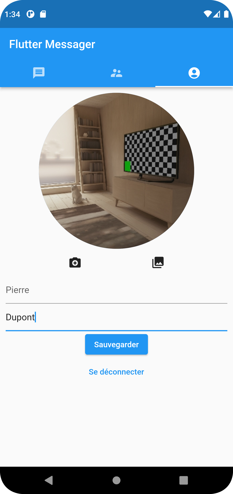
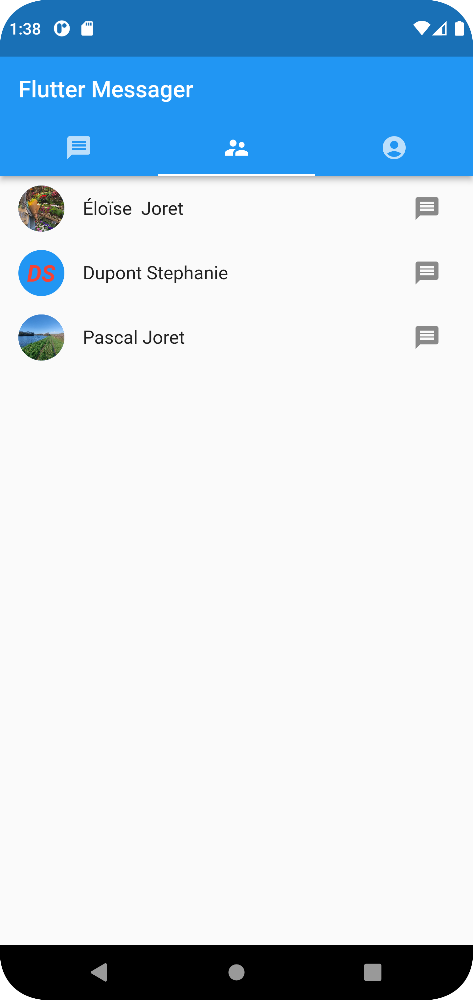
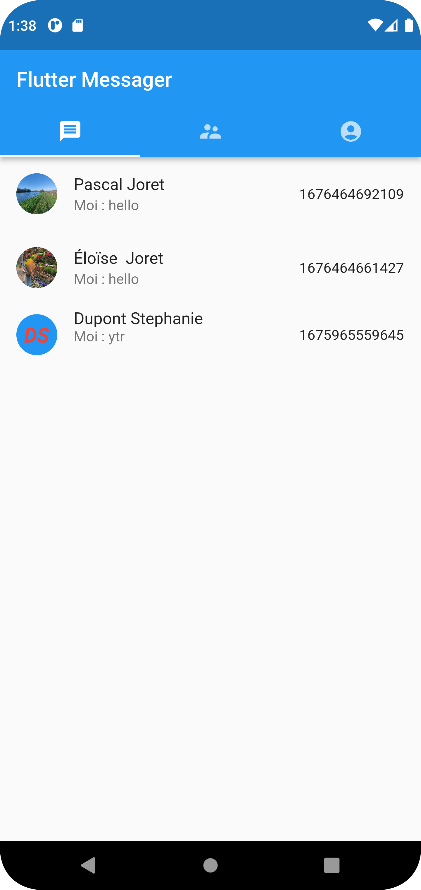

# flutter_messager_v2

Création d'une application de messagerie instantanée utilisant Flutter

### Compatible Android ou Ios

## Screenshots

### Android:

### Présentation en images:

 

 

### En cours de développement